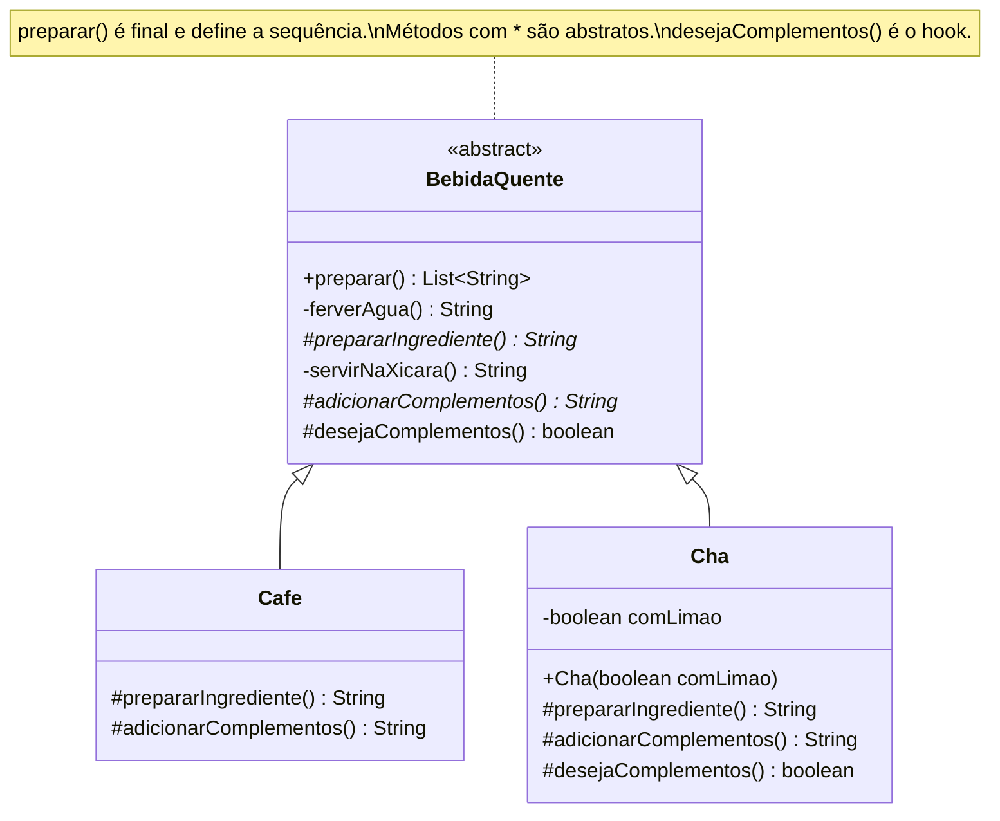

```mermaid
classDiagram
    class BebidaQuente {
        <<abstract>>
        +preparar() List~String~
        -ferverAgua() String
        #prepararIngrediente() String*
        -servirNaXicara() String
        #adicionarComplementos() String*
        #desejaComplementos() boolean
    }
    class Cafe {
        #prepararIngrediente() String
        #adicionarComplementos() String
    }
    class Cha {
        -boolean comLimao
        +Cha(boolean comLimao)
        #prepararIngrediente() String
        #adicionarComplementos() String
        #desejaComplementos() boolean
    }
    BebidaQuente <|-- Cafe
    BebidaQuente <|-- Cha
    note for BebidaQuente "preparar() é final e define a sequência.\nMétodos com * são abstratos.\ndesejaComplementos() é o hook."
```
